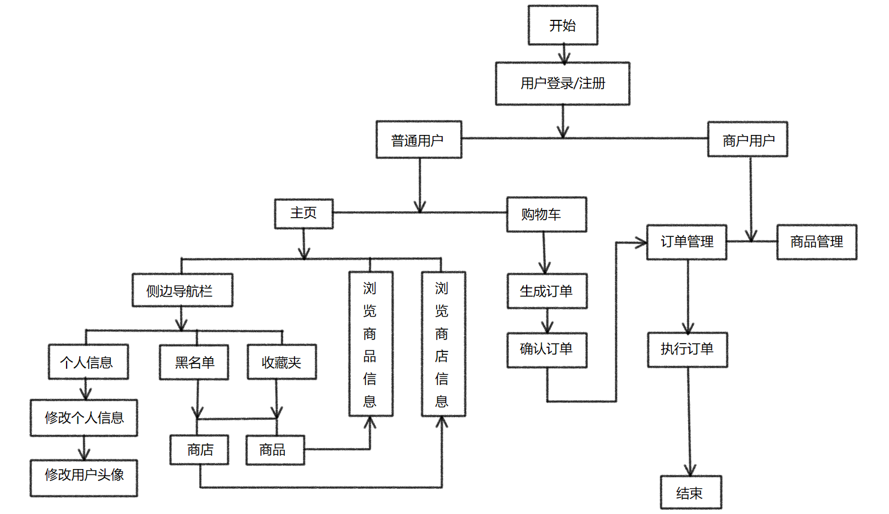
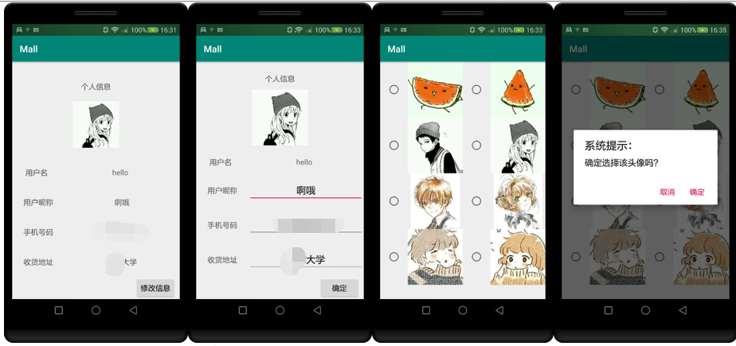

# Mall
这是一个简易购物系统的客户端。总系统利用Android技术+MySQL5.7数据库的架构实现。在Android studio上进行客户端的开发，在eclipse上进行服务器的开发，使用Tomcat服务器接收处理数据，数据库使用MySQL。

### Android客户端通信实现
主要使用http协议来进行客户端与服务器的通信，具体实现上使用HttpUrlConnection来进行通信。

### 客户端功能设定
根据用户类型，分为顾客与商户两种，不同类型的用户所需功能不同。

### 顾客功能设定
顾客主要在系统中进行购物，所需功能基本可分为 登录/注册、管理个人信息、商品/商店信息检索、浏览商品/商店信息、购物车管理、查看订单、收藏夹/黑名单以及基本的检索商品/商店功能。

1. 登录/注册功能

    顾客登录/注册功能，主要是顾客利用用户名与密码来进行登录。在客户端的实现上，主要利用文本框来获取用户输入的信息，注册时则将信息直接添加到用户数据库中，登陆时则对数据库中的信息进行比对，相符则跳转进入系统主界面，否则提示登陆失败，并通过toast给出具体失败原因，例如密码错误或者是用户名不存在等。

2. 个人信息管理功能

    顾客在成功登陆时，服务器将用户的个人信息一并返回，在跳转至主界面时加载出来。用户在个人中心可以对个人信息例如昵称，电话号码，地址等，进行修改。修改后的信息立刻在数据库中进行修改。

### 商户功能设定
商户在系统中主要进行商品经营，所需的功能基本可为 登录/注册、管理商店内商品、查看订单信息以及基本的检索商品功能。
商户与顾客登陆注册基本相同。

