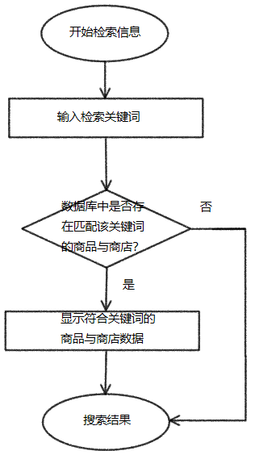
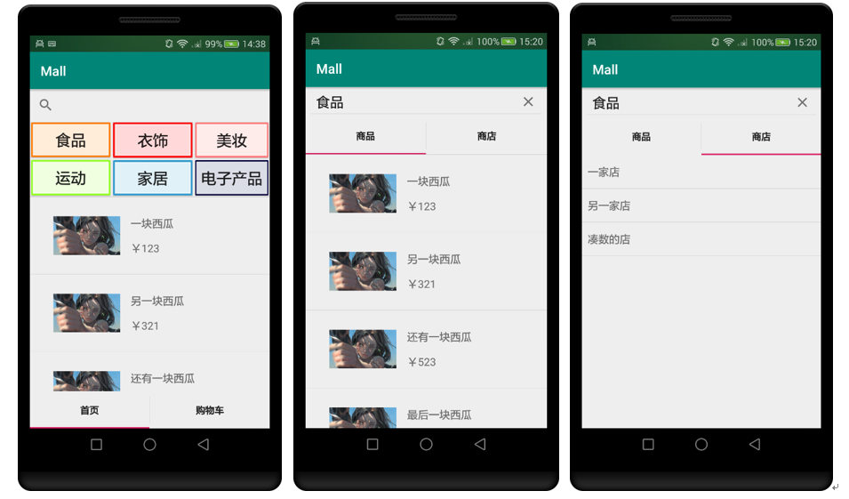
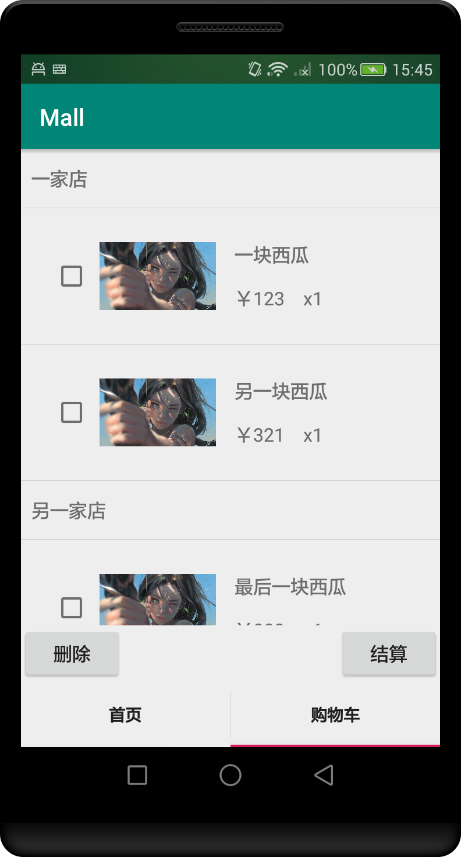

# Mall
这是一个简易购物系统的客户端。总系统利用Android技术+MySQL5.7数据库的架构实现。在Android studio上进行客户端的开发，在eclipse上进行服务器的开发，使用Tomcat服务器接收处理数据，数据库使用MySQL。

### Android客户端通信实现
主要使用http协议来进行客户端与服务器的通信，具体实现上使用HttpUrlConnection来进行通信。

### 客户端功能设定
根据用户类型，分为顾客与商户两种，不同类型的用户所需功能不同。

### 顾客功能设定
顾客主要在系统中进行购物，所需功能基本可分为 登录/注册、管理个人信息、商品/商店信息检索、浏览商品/商店信息、购物车管理、查看订单、收藏夹/黑名单以及基本的检索商品/商店功能。

### 商户功能设定
商户在系统中主要进行商品经营，所需的功能基本可为 登录/注册、管理商店内商品、查看订单信息以及基本的检索商品功能。
商户与顾客登陆注册基本相同。

1. 登录/注册功能

    顾客登录/注册功能，主要是顾客利用用户名与密码来进行登录。在客户端的实现上，主要利用文本框来获取用户输入的信息，注册时则将信息直接添加到用户数据库中，登陆时则对数据库中的信息进行比对，相符则跳转进入系统主界面，否则提示登陆失败，并通过toast给出具体失败原因，例如密码错误或者是用户名不存在等。

2. 个人信息管理功能

    顾客在成功登陆时，服务器将用户的个人信息一并返回，在跳转至主界面时加载出来。信息的显示主要使用imageview以及text文本框。用户在个人中心可以对个人信息例如昵称，电话号码，地址等，进行修改。修改后的信息立刻在数据库中进行修改。

3. 商品/商店信息检索功能

    系统主界面上方设置了一个搜索框，使用searchview来实现。用户在搜索框中输入关键词，确认搜索。系统获取关键词，向服务器发送检索请求，然后在数据库中针对关键词检索相关的商品和商店，返回结果，在搜索结果界面显示。
    

4. 购物车管理功能

    用户在浏览商品时可将商品加入购物车，并在购物车内一并处理商品。
    购物车中的商品列表使用recycleveiw组件来进行实现，列表分为商店title和商品项目两种，根据数据属性的不同采用不同的布局。商店title采用textveiw来显示商店名文本，商品项目则采用另一种布局方式将商品图片、价格和商品数量和并显示在一个列表项中。由此来实现一个大的购物车列表中包含多个不同的商店商品列表的效果。
    

